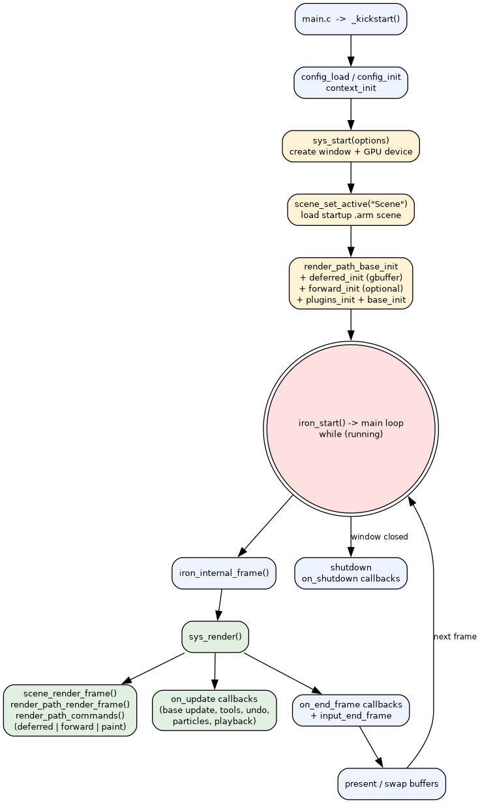
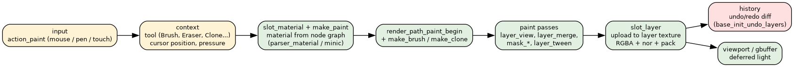
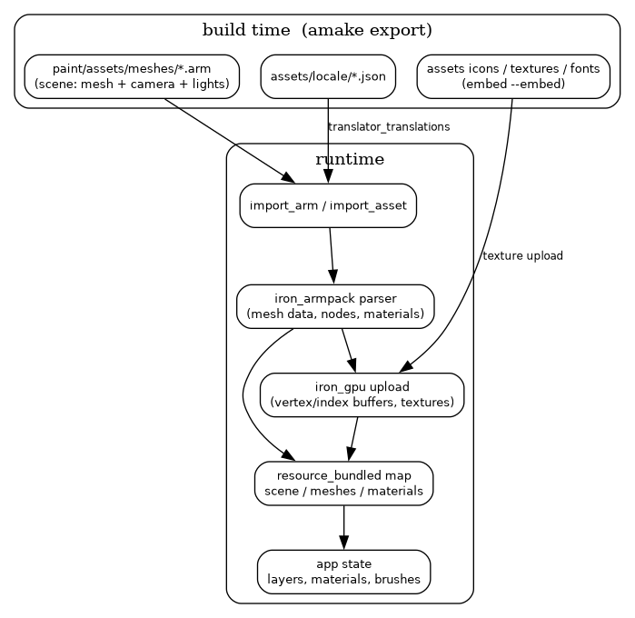

# How it works — architecture diagrams

Diagrams below explain the main flows of ArmorPaint. Sources are committed in
[`docs/diagrams/`](diagrams/) as Graphviz `.dot` files; regenerate the images with:

```bash
dot -Tpng docs/diagrams/<name>.dot -o docs/diagrams/img/<name>.png
```

## 1. Build pipeline

How a git clone becomes a runnable binary — the bundled `amake` tool exports
assets, compiles KONG shaders and generates a Makefile; then `clang` compiles
the engine, application and plugins into a single executable.


## 2. Runtime architecture

The application (`paint/sources`) builds on the iron engine (`base/sources`),
which abstracts assets, scene, GPU and system services through per-platform
backends (`base/sources/backends`).


- **core** — `iron_alloc`, `iron_array`, `iron_string`, `iron_map`, `iron_json`, `iron_math`
- **scene** — object/mesh/material model, parsed from `.arm` files by `iron_armpack`
- **draw / gpu** — `iron_gpu` and `iron_draw` render everything, from render paths to the 2D UI
- **system** — input, window, file I/O, audio, physics, net, video
- **backends** — `vulkan_gpu.c` + `linux_system.c` (Vulkan), with Metal/Direct3D12 on other OSes

## 3. Main loop

Startup order and the per-frame update/render cycle driven by
`iron_start()` → `iron_internal_frame()` → `sys_render()`.



## 4. Painting pipeline

A single brush stroke: input → context → material from the node graph →
paint passes into the active layer texture → undo history.



## 5. Data flow (assets → GPU)

Which build-time assets are loaded at runtime and how they reach GPU memory
and application state.

