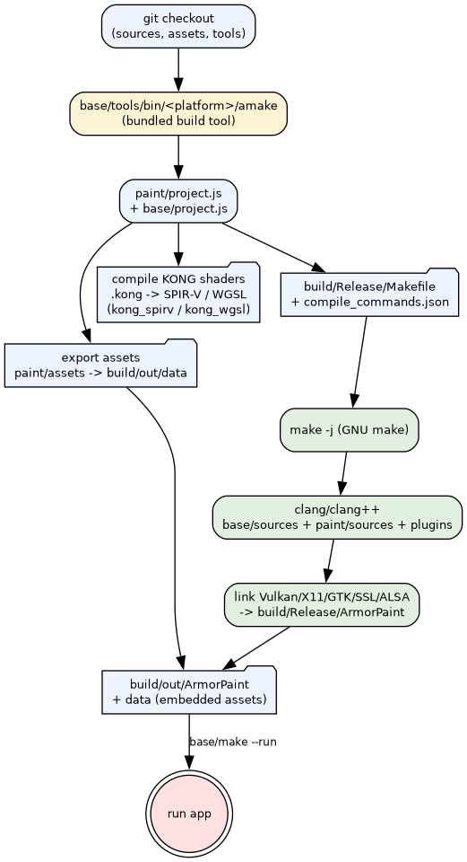
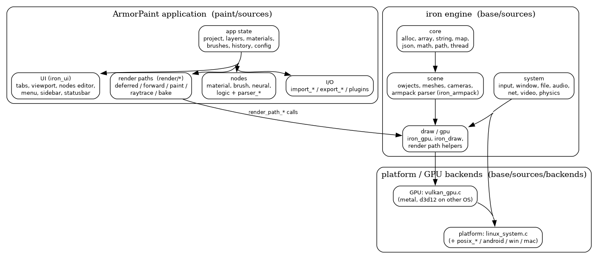

[](https://github.com/dionarley/armorpaint/actions/workflows/linux_vulkan.yml)
[](https://github.com/dionarley/armorpaint/actions/workflows/macos_metal.yml)
[](https://github.com/dionarley/armorpaint/actions/workflows/windows_direct3d12.yml)
[](license.md)


# ArmorPaint

ArmorPaint is a **3D PBR texture painting** tool — paint directly on your 3D models with a fast, layer-based workflow.

This repository contains the full source and is aimed at **developers** (builds may be unstable). Prebuilt binaries are [paid](https://armorpaint.org/download) and help fund the project — all development happens here, open source. Thank you for your support!

> **Community fork** — mirror of [armory3d/armorpaint](https://github.com/armory3d/armorpaint) with build tooling and repository polish.
> For program usage see the [ArmorPaint manual](https://armorpaint.org/manual).

## Features

- Layer-based texture painting with non-destructive blending
- PBR material support (base color, roughness, metalness, normal, height, opacity, emissive, ...)
- Procedural materials, node-based brush logic, and scripting ([minic](base/sources/iron_alloc.c) / kong shaders)
- Real-time ray-traced baking (AO, bent AO, light, thickness) — `--with-raytrace`
- Import/export: glTF/GLB, FBX, OBJ, STL, PLY, arm; images via PNG, JPG, HDR, EXR, TIFF, PSD, SVG
- Built-in mesh primitives, mesh editing tools, and UV tools
- Runs on Vulkan (Linux/Android), Direct3D12 (Windows), Metal (macOS/iOS), WebGPU (WASM)
- Plugin system (`--with-plugins`) and built-in AI tools
- Localization: 12+ languages including `pt`, `es`, `ru`, `ko`, `fr`, `de`, `ja`, `zh_cn`

## Getting started

### Requirements

- A compiler: [Visual Studio with clang tools](https://visualstudio.microsoft.com/downloads/) (Windows), [clang + dependencies](base/docs/linux_deps.md) (Linux), [Xcode](https://developer.apple.com/xcode/resources/) (macOS/iOS), [Android Studio](https://developer.android.com/studio) (Android)
- [git](https://git-scm.com/downloads)

```bash
git clone https://github.com/<your-username>/armorpaint
cd armorpaint/paint
```

### Build

**Windows (x64)**
```bash
..\base\make
# Open generated Visual Studio project at `build\ArmorPaint.sln`
# Build and run
```

**Linux (x64)**
```bash
../base/make --run
```

**macOS (arm64)**
```bash
../base/make
# Open generated Xcode project at `build/ArmorPaint.xcodeproj`
# Build and run
```

**Android (arm64)**
```bash
../base/make --target android
# Open generated Android Studio project at `build/ArmorPaint`
# Build for device
```

**iOS (arm64)**
```bash
../base/make --target ios
# Open generated Xcode project `build/ArmorPaint.xcodeproj`
# Build for device
```

**WASM (WebGPU)**
```bash
../base/make --target wasm --compile --embed
```

### Linux build & run guide

**Prebuilt (no build needed)** — install the Linux binary from a GitHub Release:

```bash
curl -fsSL https://raw.githubusercontent.com/dionarley/armorpaint/main/scripts/install.sh | sh
```

Full step-by-step build guide (outputs, flags, troubleshooting, verified build): [`docs/build_linux.md`](docs/build_linux.md).

**Prerequisites** — dependencies and verified versions are documented in [`base/docs/linux_deps.md`](base/docs/linux_deps.md):

```bash
sudo apt install make clang libvulkan-dev libgtk-3-dev libssl-dev libxi-dev libxrandr-dev libxcursor-dev libasound2-dev
```

**Build** (from `paint/`):

```bash
../base/make             # exports assets + project files (no C compilation)
../base/make --compile   # compiles C sources and links `build/Release/ArmorPaint`
```

**Run**:

```bash
../base/make --run       # compiles (if needed) and launches `build/out/ArmorPaint`
# or directly:
./build/out/ArmorPaint
```

Build logs and the generated report are kept in `paint/build/temp/` (gitignored).

### Developer tools

**Generating a locale file**
```bash
./base/make --js base/tools/extract_locales.js <locale code>
# Generates a `paint/assets/locale/<locale code>.json` file
```

**Embedding data files** (requires clang 19+ with C23 `#embed`)
```bash
../base/make --embed
```

## Documentation

Developer documentation (Doxygen) is published to GitHub Pages:

- Live site: **https://dionarley.github.io/armorpaint/**
- Sources and how to generate locally: [`docs/`](docs/) + [`Doxyfile`](Doxyfile)

### How it works

Architecture diagrams explain the build pipeline, runtime layers, main loop,
painting pipeline and asset data flow. Graphviz sources + guides live in
[`docs/diagrams.md`](docs/diagrams.md).




## Contributing

Bugs, features, questions? Read [`CONTRIBUTING.md`](CONTRIBUTING.md) first — it covers the code style, workflow, and testing conventions.

- Report bugs via the [issue tracker](https://github.com/armory3d/armorpaint/issues)
- Development forum: https://forums.armorpaint.org/c/support

## License

Distributed under the **zlib/libpng License**. See [`license.md`](license.md) (or [`LICENSE`](LICENSE)) for details.

Copyright (c) 2016-2026 ArmorPaint developers.